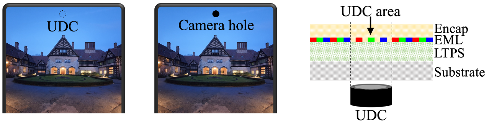
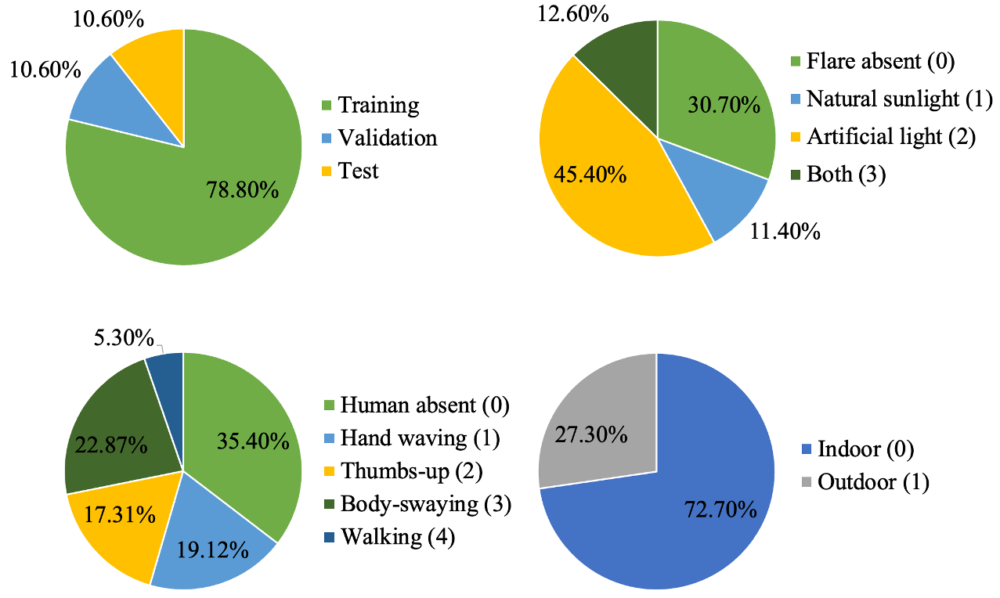

# UDC-VIT: A Real-World Video Dataset for Under-Display Cameras

This repository contains the dataset and benchmark DNN models of the following paper.

> Kyusu Ahn, JiSoo Kim, Sangik Lee, HyunGyu Lee, Byeonghyun Ko, Chanwoo Park, and Jaejin Lee.  
**UDC-VIT: A Real-World Video Dataset for Under-Display Cameras**, arXiv preprint arXiv:2501.18545 (2025).  

[[Paper](https://arxiv.org/abs/2501.18545)] [[Project site](https://kyusuahn.github.io/UDC-VIT.github.io/)]

# What is Under-Display Camera?

Under-Display Camera (UDC) is an advanced imaging system that places a digital camera lens underneath a display panel, effectively concealing the camera. However, the display panel significantly degrades captured images or videos, introducing low transmittance, blur, noise, and flare issues. Tackling such issues is challenging because of the complex degradation of UDCs, including diverse flare patterns.

# Why make this?

Despite extensive research on UDC images and their restoration models, studies on videos have yet to be significantly explored. While two UDC video datasets have been proposed, they primarily focus on unrealistic or synthetic UDC degradation rather than real-world UDC videos. In this paper, we propose a real-world UDC video dataset called UDC-VIT. Unlike previous datasets, only UDC-VIT exclusively includes human motions that target facial recognition.

# What is UDC-VIT?

The UDC-VIT dataset is a collection of well-aligned paired videos designed to address the challenges of obtaining paired video datasets in UDC settings, which often suffer from multiple degradations. To overcome these challenges, we have meticulously designed both hardware and software to ensure synchronized videos with precise alignment accuracy.

The UDC-VIT dataset exclusively captures real-world degradations such as noise, blur, decreased transmittance, and flare. Each frame in the UDC video dataset is carefully curated to depict UDC's unique flare characteristics, including spatially variant flares, light source variant flares, and temporally variant flares. This precise depiction is a distinguishing feature of UDC-VIT.

Moreover, UDC-VIT stands out from other datasets by featuring videos tailored to face recognition. The dataset is meticulously captured with Institutional Review Board (IRB) approval, involving 22 carefully selected subjects performing various motions such as hand waving, thumbs-up, body-swaying, and walking. These videos are recorded from different angles to enhance the dataset's robustness and applicability in face recognition tasks, ensuring its reliability and quality.

# How can I download the dataset?

Download the **UDC-VIT** dataset from [our research group's website](https://thunder.snu.ac.kr/?page_id=64&page=13).

# How can I use this?

It is recommended that users learn deep-learning models using the UDC-VIT dataset in `png` or `npy` formats rather than `mp4`. During training, validation, and inference, normalization should be performed in PyTorch DataLoader, as commonly practiced in many image restoration deep neural network (DNN) models. To convert the dataset from `png` to `npy`, simply execute `./udcvit_png_to_npy.py`.

# The dataset's annotation and distribution

The dataset's annotation and distribution are as follows. The parenthesis beside a label indicates its encoding. Note that a video pair can have multiple annotation labels.

# Licences

Copyright (c) 2025 Thunder Research Group at Seoul National University.

The UDC-VIT dataset is licensed under the **Creative Commons Attribution-NonCommercial-ShareAlike 4.0 International (CC BY-NC-SA 4.0)**.

**You are free to:**

- **Share** — copy and redistribute the material in any medium or format
- **Adapt** — remix, transform, and build upon the material

**Under the following terms:**

- **Attribution** — You must give appropriate credit, provide a link to the license,
               and indicate if changes were made. You may do so in any reasonable manner,
               but not in any way that suggests the licensor endorses you or your use.

- **NonCommercial** — You may not use the material for commercial purposes.

- **ShareAlike** — If you remix, transform, or build upon the material, you must
               distribute your contributions under the same license as the original.

**Additional Terms of Use:**

- **IRB approval** - You must received the **Institutional Review Board (IRB) approval** from your respective institutions.

- **Research area** - Use of the UDC-VIT dataset is strictly limited to research related to under-display camera technology.

- **Legal responsibilities** - Any legal responsibilities arising from unauthorized use or usage outside the scope of UDC research (e.g., deep fake technology) rest solely with the user.
